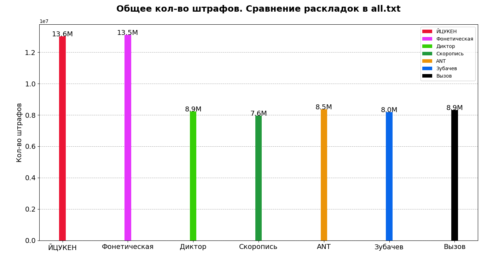
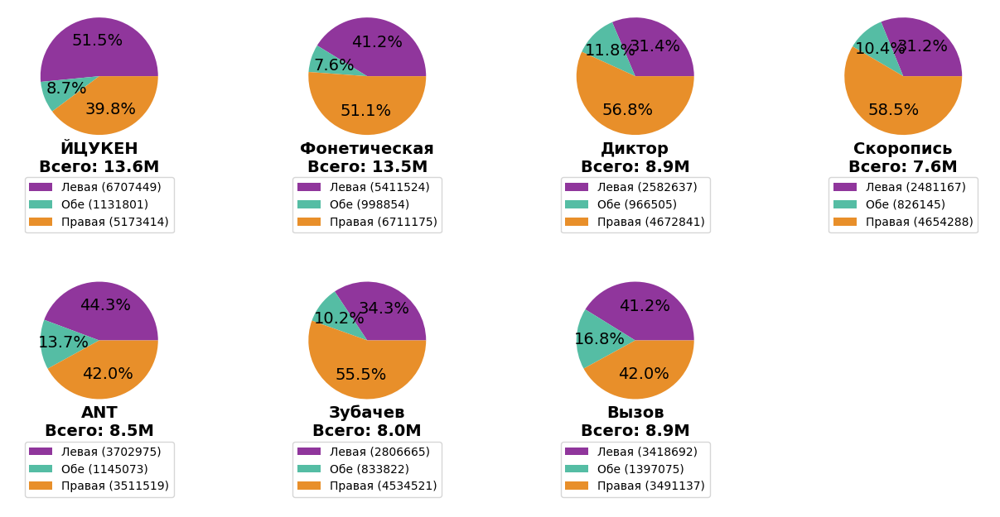
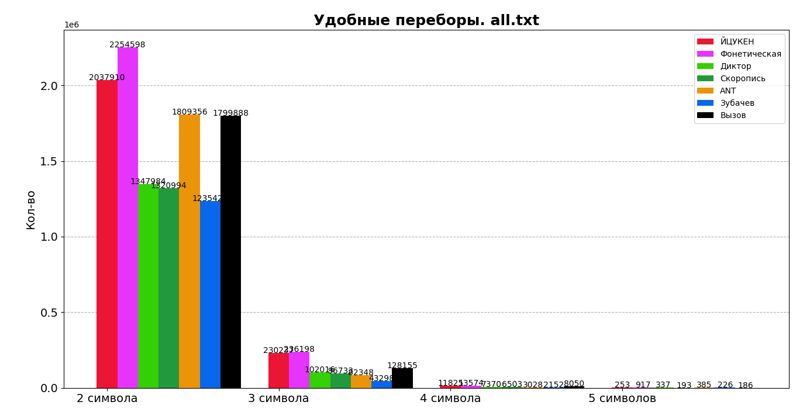
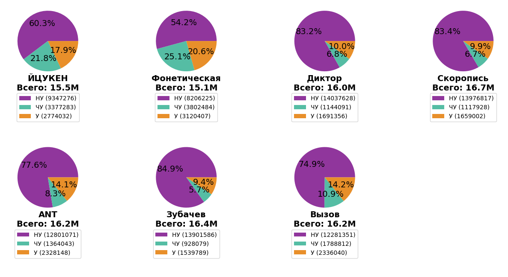
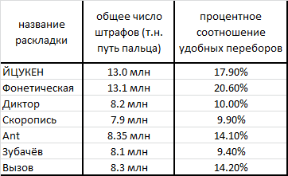

# Описанине проекта.
Данная программа считывает текстовый файл и выводит статистику по 7 раскладкам: 
* ЙЦУКЕН,
* Фонетическая,
* Диктор,
* Скоропись,
* Ant,
* Зубачёв,
* Вызов.

Статистика включает в себя:
* Общее число штрафов пальцев обеих рук (т.н. нагрузка на пальцы);
* Распределение нагрузки в процентном соотношении для правой, левой и обеих рук;
* Удобные переборы, разбитые на двусимвольные, трёхсимвольные и т.д.;
* Процентное соотношение переборов разной степени удобства.

# Как использовать проект klava.
При запуске программа предложит ряд вопросов:
### Как считаем штрафы?
1. Статически
2. Динамически
### Что хотим сделать?
1. Проланализировать одну раскладку
2. Сравнить несколько раскладок
### Выберите раскладку(-и):
1. ЙЦУКЕН
2. Фонетическая
3. Диктор
4. Скоропись
5. ANT
6. Зубачёв
7. Вызов
При выборе сравнения нескольких раскладок введите номера нужных через пробел.
### Что хотим сделать?
1. Прогнать через файл
2. Штрафы построчно
### Результат:
После введения пути к текстовому файлу, выводится результат в виде двух типов диаграмм: линейной и круговой. При выборе "Штрафы построчно" в дополнение к диаграммам создаётся файл result.txt с индивидуальными результатами для каждой строчки текстового файла.

# Анализируемый текст.
Далее будут представлены результаты программы в виде анализа текстового файла all.txt, который содержит в себе:
* текст романа "Война и мир",
* ряд популярных двусимвольных переборов,
* лексемы русского языка.
  
# Статические штрафы.
На линейной диаграмме представлено общее число штрафов пальцев обеих рук (т.н. нагрузка на пальцы), а на круговой - распределение нагрузки в процентном соотношении для правой, левой и обеих рук одновременно при наборе выбранного текстового файла. На рисунках ниже представлен пример диаграмм для текстового файла all.txt при условии что выбрано сравнение всех раскладок:

# Динамические штрафы.
На линейной диаграмме представлено число удобных переборов (разбитых на двусимвольные, трёхсимвольные и т.д.) для выбранных раскладок. На круговой диаграмме - процентное соотношение переборов вида: 
* У - удобные (т.е. переход пальцев от внешних к внутренним),
* ЧУ - частично удобные (т.е. смена направления пальцев на одной руке),
* НУ - неудобные (т.е. смена рук - сначала правая, потом левая и т.д.).
  
На рисунках ниже представлен пример диаграмм для текстового файла all.txt при условии что выбрано сравнение всех раскладок:

# Вывод.
Ниже будут представлены результаты анализа раскладок при наборе ткстового файла all.txt:

### Лабораторная работа 1 "Статические штрафы".
Программа считает общее число штрафов пальцев обеих рук (т.н. путь пальца). Анализируя полученные абсолютные пути по всем раскладкам, можно прийти к выводу, что наибольшее и наименьшее число штрафов имеют раскладки ЙЦУКЕН и Скоропись соответственно.
 
### Лабораторная работа 2 "Динамические штрафы".
Программа считает количество удобных переборов и их процентное соотношение относительно частично удобных и неудобных по каждой раскладке. Из таблицы результатов видно, что раскладка Фонетическая имеет наибольший процент удобных переборов.
